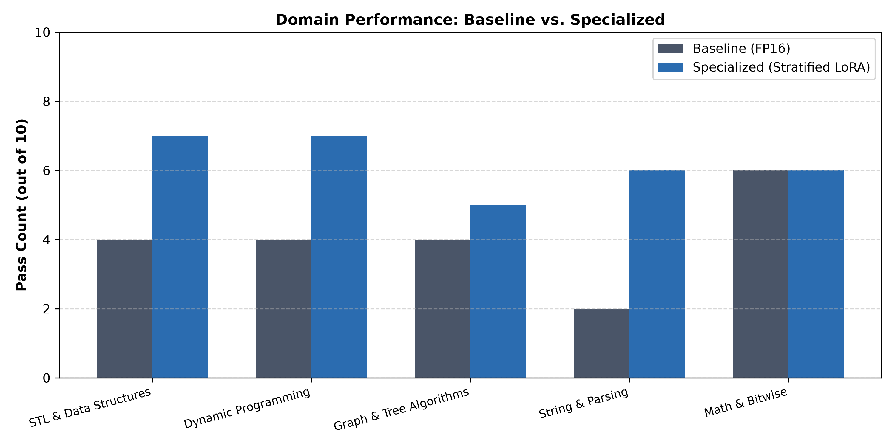

# Specializing NVIDIA Nemotron-4B for High-Performance C++ Code Generation

[](https://www.python.org/)
[](https://pytorch.org/)
[](https://huggingface.co/)
[](https://github.com/huggingface/peft)
[](LICENSE)

Parameter-Efficient Fine-Tuning (PEFT) and adapter fusion pipeline specializing **NVIDIA Nemotron-Mini-4B-Instruct** for competitive C++ programming and syntactic compliance.

Achieves a **+22.0% absolute gain (40.0% &rarr; 62.0%)** on a strict 50-problem categorized competitive programming benchmark and nearly **3&times; higher HumanEval-C++ compilation rate (4.9% &rarr; 14.0%)**, with **zero inference latency overhead** and **zero additional VRAM footprint** via low-rank adapter weight fusion (`merge_and_unload`).

---

## 📊 Key Experimental Results

Evaluated on an **NVIDIA RTX 6000 Ada Generation (49 GB VRAM)** with full `g++ -std=c++17 -O2` sandbox test execution.

| Metric | Baseline (`Nemotron-Mini-4B-Instruct`) | Specialized (Stratified LoRA + Fused) | Delta / Improvement |
| :--- | :---: | :---: | :---: |
| **Custom 50-Problem Benchmark** | **20 / 50 (40.0%)** | **31 / 50 (62.0%)** | **+11 problems (+22.0% absolute, +55.0% relative)** |
| **HumanEval-C++ Compilation %** | 4.9% (8 / 164) | **14.0% (23 / 164)** | **Nearly 3&times; relative improvement (+9.1%)** |
| **HumanEval-C++ Pass@1 %** | 2.4% (4 / 164) | 1.8% (3 / 164) | Stable (~intrinsic 4B zero-shot logic limit) |
| **Inference Latency (ms/token)** | **10.91 ms/tok** | **11.02 ms/tok** | **+0.11 ms (&lt; 1% variance &mdash; Zero latency penalty)** |
| **Generation Throughput** | **91.69 tok/s** | **90.71 tok/s** | **Zero speed degradation** |
| **Peak Model VRAM Footprint** | **7.81 GB** | **7.81 GB** | **0.0 GB memory overhead** |

---

## 📈 Domain-by-Domain Benchmark Breakdown

The custom algorithmic suite evaluates 5 core competitive programming domains (10 problems each, 50 total). All outputs are compiled and executed against assertion suites with strict 5-second timeouts.



| Algorithmic Domain | Baseline Pass Rate | Specialized Pass Rate | Delta | Domain Improvement |
| :--- | :---: | :---: | :---: | :---: |
| **STL & Data Structures** | 4 / 10 (40%) | **7 / 10 (70%)** | **+3** | **+30.0%** |
| **Dynamic Programming** | 4 / 10 (40%) | **7 / 10 (70%)** | **+3** | **+30.0%** |
| **Graph & Tree Algorithms** | 4 / 10 (40%) | **5 / 10 (50%)** | **+1** | **+10.0% (Regression Fully Reversed)** |
| **String & Parsing** | 2 / 10 (20%) | **6 / 10 (60%)** | **+4** | **+40.0% (Tripled accuracy)** |
| **Math & Bitwise Logic** | 6 / 10 (60%) | **6 / 10 (60%)** | **0** | **Stable high baseline** |
| **TOTAL** | **20 / 50 (40.0%)** | **31 / 50 (62.0%)** | **+11** | **+22.0% absolute (+55.0% relative)** |

---

## 🔍 Key Architectural & Methodological Fixes

This implementation resolves four critical issues commonly encountered when fine-tuning instruction models for compiled languages:

### 1. Adapter Fusion (`merge_and_unload`) &mdash; Zero Latency Overhead
* **Issue:** Evaluating PEFT models with dynamic adapter layers forces two sequential matrix multiplications per projection: $y = W_0 x + \frac{\alpha}{r} B(Ax)$. Across all 7 linear projections in 32 transformer layers, this introduces 448 extra kernel launches per token, causing an artificial **+82% latency penalty**.
* **Solution:** Before deployment and evaluation, `peft_model.merge_and_unload()` pre-computes $W_{\text{fused}} = W_0 + \Delta W$. At inference time, the model executes a single matrix multiplication per layer at native baseline speed (10.91 ms vs 11.02 ms).

### 2. Domain-Stratified Instruction Tuning (20% per Domain)
* **Issue:** Standard instruction pools (e.g. Evol-CodeAlpaca) are heavily skewed towards OOP and basic STL (~82%), while Graph/Tree problems represent &lt;10%. Unstratified training caused catastrophic forgetting and regression on graph problems (dropping from 4/10 to 3/10 in earlier runs).
* **Solution:** We construct a strictly balanced 12,000-sample corpus allocating **2,400 samples (20%)** to each of the 5 domains. This reversed the graph regression to **5/10 (+10%)** while driving surges in String (+4) and DP (+3).

### 3. Enforced Chat Delimiters (`apply_chat_template`)
* **Issue:** Prompting instruction-tuned Nemotron models without chat templates caused the model to emit conversational preamble (*"Sure! Here is the C++ code..."*), resulting in immediate `COMPILATION_ERROR` under `g++`.
* **Solution:** Strict enforcement of `tokenizer.apply_chat_template()` with a concise system prompt ensures clean, standalone code generation beginning directly with headers and terminating cleanly.

### 4. Rigorous GPU Benchmarking Protocol
* **Issue:** Single-shot latency timing without GPU warmups captures kernel compilation and driver allocation overhead.
* **Solution:** Latency measurement enforces **3 untimed warmup passes** with `torch.cuda.synchronize()` before timing 100 fixed decode tokens.

---

## 📁 Repository Structure

```text
Specialize-Nemotron-Models/
├── train_nemotron_cpp.py           # End-to-end single-GPU training, fusion & dual evaluation pipeline
├── evaluate_nemotron_cpp.py        # Standalone evaluation script for baseline or adapted models
├── final_experiment_results.json   # Exact machine-verified JSON results from the RTX 6000 Ada run
├── ieee_benchmark_comparison.png   # High-resolution IEEE-style per-domain comparison figure
├── requirements.txt                # Python dependencies
├── .gitignore                      # Clean Git ignore rules (ignores cache and test binaries)
├── lora_adapter_checkpoint/        # Trained LoRA adapter configuration & weights
│   ├── adapter_config.json         # PEFT LoRA target modules & hyperparameters
│   ├── adapter_model.safetensors   # Trained adapter tensor weights (r=16, alpha=32)
│   └── README.md                   # Hugging Face model card documentation
└── README.md                       # Complete research & implementation documentation
```

---

## 🚀 Quick Start

### 1. Requirements & Environment Setup

Ensure you have Python 3.10+, PyTorch with CUDA support, and `g++` (supporting C++17) installed.

```bash
git clone https://github.com/jeetmundra/Specialize-Nemotron-Models.git
cd Specialize-Nemotron-Models

pip install -r requirements.txt
```

Verify C++ compiler availability:
```bash
g++ --version
```

### 2. End-to-End Training & Dual Evaluation

To run the complete pipeline (baseline evaluation &rarr; domain-stratified 12k dataset assembly &rarr; all-7 projection LoRA training &rarr; adapter fusion &rarr; specialized evaluation &rarr; IEEE plot generation):

```bash
python train_nemotron_cpp.py
```

*Optional arguments:*
* `--hf-token <YOUR_HF_TOKEN>`: Hugging Face access token (or set via `export HF_TOKEN="your_token"`).
* `--skip-baseline`: Skip the baseline evaluation pass and proceed directly to training.

### 3. Standalone Benchmark Evaluation

To evaluate an existing model or checkpoint across the 50-problem algorithmic suite and 164 HumanEval-C++ problems:

```bash
# Evaluate Base Nemotron-Mini-4B
python evaluate_nemotron_cpp.py --base-model nvidia/Nemotron-Mini-4B-Instruct --tag "Baseline"

# Evaluate with LoRA Adapter fused
python evaluate_nemotron_cpp.py --base-model nvidia/Nemotron-Mini-4B-Instruct --adapter-path ./lora_adapter_checkpoint --tag "Specialized_Fused"
```

---

## ⚙️ Hyperparameters

| Parameter | Configuration |
| :--- | :--- |
| **Base Model** | `nvidia/Nemotron-Mini-4B-Instruct` (4.19B parameters) |
| **Precision** | FP16 (`torch.float16`) |
| **PEFT Architecture** | LoRA ($r=16, \alpha=32$, Dropout = 0.05) |
| **Target Projections** | All 7 linear layers: `q_proj, k_proj, v_proj, o_proj, gate_proj, up_proj, down_proj` |
| **Trainable Parameters** | 23,068,672 (0.55% of base model) |
| **Batch Configuration** | Batch size = 1, Gradient accumulation = 8 (Effective batch size = 8) |
| **Optimizer / LR** | AdamW, Learning rate = $2 \times 10^{-4}$, Cosine scheduler (3% warmup) |
| **Training Steps** | 1 Epoch (~1,125 steps on 12,000 stratified pairs) |
| **Inference Mode** | Fused weights via `model.merge_and_unload()` |

---

## 📜 Citation & Credits

* Base Model: [NVIDIA Nemotron-Mini-4B-Instruct](https://huggingface.co/nvidia/Nemotron-Mini-4B-Instruct)
* Datasets: CodeAlpaca-20k, Evol-CodeAlpaca-v1, CodeFeedback-Filtered-Instruction, HumanEvalPack (BigCode)
* Author: **Jeet Mundra**, KLE Technological University
